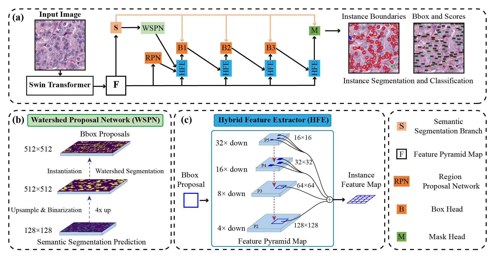

# NuHTC: A Hybrid Task Cascade for Nuclei Instance Segmentation and Classification

>  [Bao Li](https://boyden.github.io), et al.


This repo is the official implementation of NuHTC.

## Overlaid Segmentation and Classification Prediction
The demo may take around 10s to load. 


## 👉 Setup Environment
Setup the Python environment

```shell script
# Note, please follow the env.
conda create -n nuhtc -y python=3.10 
conda activate nuhtc
conda install pytorch==1.13.1 torchvision==0.14.1 torchaudio==0.13.1 pytorch-cuda=11.6 -c pytorch -c nvidia
pip install -r requirements.txt
pip install mmcv-full==1.7.2 -f https://download.openmmlab.com/mmcv/dist/cu116/torch1.13/index.html
python -m pip install histomicstk==1.2.10 --find-links https://girder.github.io/large_image_wheels -i https://pypi.org/simple
```

## 👉 Preporcessing data
First please download and unzip the files from [PanNuke dataset](https://warwick.ac.uk/fac/cross_fac/tia/data/pannuke) where the folder structure should look this:

```
NuHTC
├── ...
├── datasets
│   ├── PanNuke
│   │   ├── images
│   │   │   ├── fold1
│   │   │   │   ├── images.npy
│   │   │   ├── fold2
│   │   │   │   ├── images.npy
│   │   │   ├── fold3
│   │   │   │   ├── images.npy
│   │   ├── masks
│   │   │   ├── fold1
│   │   │   │   ├── masks.npy
│   │   │   │   ├── types.npy
│   │   │   ├── fold2
│   │   │   │   ├── masks.npy
│   │   │   │   ├── types.npy
│   │   │   ├── fold3
│   │   │   │   ├── masks.npy
│   │   │   │   ├── types.npy
├── ...
```
For the coco format annotation, please download the `coco` folder json file from [Google Drive](https://drive.google.com/drive/folders/1MezZrVwx7S6MNYkpMO5ja2D6KcZkRvYo?usp=sharing)
```
NuHTC
├── ...
├── coco
│   ├── PanNuke
│   │   ├── PanNuke_annt_RLE_fold1.json
│   │   ├── PanNuke_annt_RLE_fold2.json
│   │   ├── PanNuke_annt_RLE_fold3.json
├── ...
```
Then generating `png` files for training and test.
```python
import os
import numpy as np
from PIL import Image
from tqdm import tqdm

basedir = './datasets/PanNuke'
for fold in range(3):
    print(f'Preprocessing images: fold{fold+1}')
    imgdir = f'{basedir}/images/fold{fold+1}'
    img_data = np.load(f'{imgdir}/images.npy', mmap_mode='r')
    for i in tqdm(range(img_data.shape[0])):
        img = Image.fromarray(img_data[i].astype(np.uint8))
        os.makedirs(f'{basedir}/rgb', exist_ok=True)
        if not os.path.exists(f'{basedir}/rgb/fold{fold+1}_{i+1}.png'):
            img.convert('RGB').save(f'{basedir}/rgb/fold{fold+1}_{i+1}.png')

for fold in range(3):
    print(f'Preprocessing masks: fold{fold+1}')
    imgdir = f'{basedir}/masks/fold{fold+1}'
    img_data = np.load(f'{imgdir}/masks.npy', mmap_mode='r')
    for i in tqdm(range(img_data.shape[0])):
        img = 1 - img_data[i, :, :, 5]
        img = Image.fromarray(img.astype(np.uint8))
        os.makedirs(f'{basedir}/rgb_seg', exist_ok=True)
        if not os.path.exists(f'{basedir}/rgb_seg/fold{fold+1}_{i+1}.png'):
            img.save(f'{basedir}/rgb_seg/fold{fold+1}_{i+1}.png')
```

## 👉 Train
```shell script
# Please modify the `fold = 1` content to change the fold.
CUDA_VISIBLE_DEVICES=0 python tools/train.py configs/nuhtc/htc_lite_swin_pytorch_fpn_PanNuke_seasaw_CAS.py --no-validate
```

Note, recent update (~May 2024, driver version 555.85, 555.99, 556.12) of Nvidia driver may lead to `UnicodeDecodeError: 'utf-8' codec can't decode byte 0xf8 in position 0: invalid start byte` in init wandb package. If your nvidia driver version is greater than `552.44`, please downgrade to the `Nvidia 552.44 studio driver` or update to the version greater than `560.70` for successfully training the models. For more details, please refer to [wandb issue](https://github.com/wandb/wandb/issues/7683).

## 👉 Test
``` shell script
CONFIG_NAME=htc_lite_swin_pytorch_fpn_PanNuke_seasaw_CAS.py
WEIGHT_BASE_PATH=work_dirs/htc_lite_swin_pytorch_seasaw_FPN_AttenROI_thres_96_base_aug_cas_PanNuke_full_epoch_200_fold1

# predict nuclei from images
CUDA_VISIBLE_DEVICES=0 python tools/test.py $WEIGHT_BASE_PATH/$CONFIG_NAME $WEIGHT_BASE_PATH/latest.pth \
--eval bbox --samples_per_gpu 16 \
--eval-options save=True format=pannuke save_path=$WEIGHT_BASE_PATH overlay=False

# calculate the metric
python tools/analysis_tools/pannuke/compute_stats.py --true_path=datasets/PanNuke/masks/fold3/masks.npy --type_path=datasets/PanNuke/masks/fold3/types.npy \
--pred_path=$WEIGHT_BASE_PATH/PanNukeCocoDataset/preds_pannuke.npy --save_path=$WEIGHT_BASE_PATH
```

## 👉 Infer
Our trained checkpoint can be downloaded from the `models` folder in the [Google Drive](https://drive.google.com/drive/folders/1MezZrVwx7S6MNYkpMO5ja2D6KcZkRvYo?usp=sharing).
```shell script
# Segment image by image
CUDA_VISIBLE_DEVICES=0 python tools/infer.py demo/imgs configs/nuhtc/htc_lite_swin_pytorch_fpn_PanNuke_seasaw_CAS.py models/pannuke.pth --out demo/imgs_infer
```

## 🚀 Segment the Whole Slide Image
Segment for the WSI with support output version: `qupath`, `sql`, `dsa`, and `coco`. Do not automatically support various magnifications. (Default: 40X).

(Note: we support the version of both nuclei point and contour for qupath format. Coco is only for storing the patch nuclei segmentation results now)
```shell script
CUDA_VISIBLE_DEVICES=0 python tools/infer_wsi.py demo/wsi configs/nuhtc/htc_lite_swin_pytorch_fpn_PanNuke_seasaw_CAS.py models/pannuke.pth \
--out demo/wsi_res --patch --seg --stitch --space 256 --step_size 192 --margin 2 --min_area 10 \
--save_dir demo/wsi_infer --mode qupath --no_auto_skip
```
We provide a WSI example from TCGA (filename: `TCGA-AC-A2FK-01Z-00-DX1.033F3C27-9860-4EF3-9330-37DE5EC45724.svs`), which includes the `geojson` file for both nuclei points and contours. These can be easily dragged into, viewed, and edited using [QuPath](https://qupath.github.io/). The WSI example can be downloaded from [Google Drive](https://drive.google.com/drive/folders/1UdCixl10kBxyKHUGOww4WIkdoFma-UIr?usp=drive_link).

The `dsa` is a format supported by [Digital Slide Archive](https://digitalslidearchive.github.io/digital_slide_archive/), a powerful containerized web-based platform for storing, managing, viewing, and analysing WSIs. If you are interested in using the DSA platform, please refer to its [deployment instructions](https://github.com/DigitalSlideArchive/digital_slide_archive/blob/master/devops/dsa/README.rst).

Our model is trained with a patch size `256×256` at 40X magnification. During inference, it maintains strong performance even when evaluated with a larger patch size of `512×512`. To run inference using `512×512` patches, please specify the arguments `--space 512 --step_size 448`.

## 🔬 Extract the Nuclei Feature
Please specify `--mode coco` or `--mode all` during WSI inference. Make sure you have installed the [histomicstk](https://digitalslidearchive.github.io/HistomicsTK/) successfully.
```shell script
python tools/nuclei_feat_extract.py demo/wsi_res
# datadir (str)
# Path to the folder containing raw WSI image files.

# --start (int, default: 0)
# Starting index of the slides to process. Useful for batching or parallel execution.
# --end (int, default: None)
# Ending index (exclusive) of the slides to process. If not specified, all remaining slides will be processed.
# --min_num (int, default: 8)
# Minimum number of nuclei required in a patch. Patches with fewer nuclei will be excluded.
# --patch_size (int, default: 512)
# Size (in pixels) of each image patch. Should match the expected input size (e.g. 256 or 512 for 40X resolution) used during inference.
# --reverse (flag, default: False)
# If specified, slide IDs will be processed in reverse order.
```
It will extract the nuclei feature for each image and then store them in a csv file. The following is an example for the nuclei feature csv file.
|     | Label | Identifier.Xmin | Identifier.Ymin | Identifier.Xmax | Identifier.Ymax | Identifier.CentroidX | Identifier.CentroidY | Identifier.WeightedCentroidX | Identifier.WeightedCentroidY | Orientation.Orientation | Size.Area | Size.ConvexHullArea | Size.MajorAxisLength | Size.MinorAxisLength | Size.Perimeter | Shape.Circularity | Shape.Eccentricity | Shape.EquivalentDiameter | Shape.Extent | Shape.FractalDimension | Shape.MinorMajorAxisRatio | Shape.Solidity | Shape.HuMoments1 | Shape.HuMoments2 | Shape.HuMoments3 | Shape.HuMoments4 | Shape.HuMoments5 | Shape.HuMoments6 | Shape.HuMoments7 | Shape.WeightedHuMoments1 | Shape.WeightedHuMoments2 | Shape.WeightedHuMoments3 | Shape.WeightedHuMoments4 | Shape.WeightedHuMoments5 | Shape.WeightedHuMoments6 | Shape.WeightedHuMoments7 | Shape.FSD1 | Shape.FSD2 | Shape.FSD3 | Shape.FSD4 | Shape.FSD5 | Shape.FSD6 | Nucleus.Intensity.Min | Nucleus.Intensity.Max | Nucleus.Intensity.Mean | Nucleus.Intensity.Median | Nucleus.Intensity.MeanMedianDiff | Nucleus.Intensity.Std | Nucleus.Intensity.IQR | Nucleus.Intensity.MAD | Nucleus.Intensity.Skewness | Nucleus.Intensity.Kurtosis | Nucleus.Intensity.HistEnergy | Nucleus.Intensity.HistEntropy | Nucleus.Gradient.Mag.Mean | Nucleus.Gradient.Mag.Std | Nucleus.Gradient.Mag.Skewness | Nucleus.Gradient.Mag.Kurtosis | Nucleus.Gradient.Mag.HistEntropy | Nucleus.Gradient.Mag.HistEnergy | Nucleus.Gradient.Canny.Sum | Nucleus.Gradient.Canny.Mean | Nucleus.Haralick.ASM.Mean | Nucleus.Haralick.ASM.Range | Nucleus.Haralick.Contrast.Mean | Nucleus.Haralick.Contrast.Range | Nucleus.Haralick.Correlation.Mean | Nucleus.Haralick.Correlation.Range | Nucleus.Haralick.SumOfSquares.Mean | Nucleus.Haralick.SumOfSquares.Range | Nucleus.Haralick.IDM.Mean | Nucleus.Haralick.IDM.Range | Nucleus.Haralick.SumAverage.Mean | Nucleus.Haralick.SumAverage.Range | Nucleus.Haralick.SumVariance.Mean | Nucleus.Haralick.SumVariance.Range | Nucleus.Haralick.SumEntropy.Mean | Nucleus.Haralick.SumEntropy.Range | Nucleus.Haralick.Entropy.Mean | Nucleus.Haralick.Entropy.Range | Nucleus.Haralick.DifferenceVariance.Mean | Nucleus.Haralick.DifferenceVariance.Range | Nucleus.Haralick.DifferenceEntropy.Mean | Nucleus.Haralick.DifferenceEntropy.Range | Nucleus.Haralick.IMC1.Mean | Nucleus.Haralick.IMC1.Range | Nucleus.Haralick.IMC2.Mean | Nucleus.Haralick.IMC2.Range | cell_type | img_id | img_type | img_objs | file_name |
|-----|-------|-----------------|-----------------|-----------------|-----------------|----------------------|----------------------|------------------------------|------------------------------|-------------------------|-----------|---------------------|----------------------|----------------------|----------------|-------------------|--------------------|--------------------------|--------------|------------------------|---------------------------|----------------|------------------|------------------|------------------|------------------|------------------|------------------|------------------|--------------------------|--------------------------|--------------------------|--------------------------|--------------------------|--------------------------|--------------------------|------------|------------|------------|------------|------------|------------|-----------------------|-----------------------|------------------------|--------------------------|----------------------------------|-----------------------|-----------------------|-----------------------|----------------------------|----------------------------|------------------------------|-------------------------------|---------------------------|--------------------------|-------------------------------|-------------------------------|----------------------------------|---------------------------------|----------------------------|-----------------------------|---------------------------|----------------------------|--------------------------------|---------------------------------|-----------------------------------|------------------------------------|------------------------------------|-------------------------------------|---------------------------|----------------------------|----------------------------------|-----------------------------------|-----------------------------------|------------------------------------|----------------------------------|-----------------------------------|-------------------------------|--------------------------------|------------------------------------------|-------------------------------------------|-----------------------------------------|------------------------------------------|----------------------------|-----------------------------|----------------------------|-----------------------------|-----------|--------|----------|----------|-----------|
| 211 | 1     | 322             | 402             | 356             | 442             | 338.111              | 421.776              | 337.964                      | 422.038                      | 0.319                   | 1028.000  | 1079.000            | 40.400               | 32.539               | 131.698        | 0.745             | 0.593              | 36.179                   | 0.756        | 0.851                  | 0.805                     | 0.953          | 0.164            | 0.001            | 0.000            | 0.000            | -0.000           | -0.000           | -0.000           | 0.001                    | 0.000                    | 0.000                    | 0.000                    | 0.000                    | -0.000                   | 0.000                    | 0.231      | 0.003      | 0.004      | 0.006      | 0.119      | 0.307      | 94.000                | 251.000               | 210.930                | 214.000                  | -3.070                           | 21.928                | 26.000                | 13.000                | -1.193                     | 2.762                      | 0.224                        | 1.677                         | 10.849                    | 10.623                   | 1.933                         | 3.910                         | 1.394                            | 0.340                           | 139.000                    | 0.135                       | 0.021                     | 0.005                      | 4.897                          | 4.211                           | 0.950                             | 0.045                              | 49.706                             | 2.771                               | 0.563                     | 0.080                      | 44.098                           | 0.556                             | 193.929                           | 15.296                             | 5.182                            | 0.058                             | 6.760                         | 0.383                          | 0.008                                    | 0.002                                     | 2.252                                   | 0.432                                    | -0.399                     | 0.107                       | 0.982                      | 0.017                       | E         | 28     | C        | 32       | 28.png    |
| 212 | 2     | 260             | 464             | 294             | 506             | 276.493              | 484.931              | 276.498                      | 484.768                      | 0.274                   | 1076.000  | 1141.000            | 42.793               | 32.271               | 136.284        | 0.728             | 0.657              | 37.014                   | 0.754        | 0.921                  | 0.754                     | 0.943          | 0.167            | 0.002            | 0.000            | 0.000            | 0.000            | 0.000            | 0.000            | 0.001                    | 0.000                    | 0.000                    | 0.000                    | -0.000                   | -0.000                   | -0.000                   | 0.391      | 0.002      | 0.005      | 0.010      | 0.040      | 0.270      | 99.000                | 252.000               | 218.624                | 223.500                  | -4.876                           | 21.567                | 21.000                | 10.500                | -1.869                     | 5.051                      | 0.261                        | 1.579                         | 11.734                    | 13.013                   | 1.946                         | 3.175                         | 1.493                            | 0.332                           | 179.000                    | 0.166                       | 0.028                     | 0.013                      | 5.475                          | 6.951                           | 0.946                             | 0.070                              | 51.300                             | 2.937                               | 0.552                     | 0.173                      | 46.675                           | 0.499                             | 199.723                           | 16.808                             | 4.970                            | 0.052                             | 6.488                         | 0.596                          | 0.007                                    | 0.003                                     | 2.302                                   | 0.703                                    | -0.381                     | 0.166                       | 0.974                      | 0.032                       | E         | 28     | C        | 32       | 28.png    |
| 213 | 3     | 292             | 446             | 328             | 486             | 309.592              | 465.089              | 309.533                      | 465.186                      | -0.464                  | 1128.000  | 1186.000            | 42.413               | 34.066               | 136.870        | 0.757             | 0.596              | 37.897                   | 0.783        | 0.805                  | 0.803                     | 0.951          | 0.164            | 0.001            | 0.000            | 0.000            | -0.000           | -0.000           | 0.000            | 0.001                    | 0.000                    | 0.000                    | 0.000                    | -0.000                   | -0.000                   | -0.000                   | 0.464      | 0.001      | 0.004      | 0.009      | 0.032      | 0.232      | 75.000                | 249.000               | 206.606                | 215.000                  | -8.394                           | 27.996                | 33.000                | 14.000                | -1.380                     | 2.014                      | 0.226                        | 1.728                         | 11.476                    | 10.901                   | 1.674                         | 2.224                         | 1.655                            | 0.262                           | 165.000                    | 0.146                       | 0.025                     | 0.005                      | 3.773                          | 2.798                           | 0.949                             | 0.040                              | 37.297                             | 2.146                               | 0.568                     | 0.101                      | 45.545                           | 0.499                             | 145.417                           | 11.384                             | 5.082                            | 0.050                             | 6.550                         | 0.338                          | 0.008                                    | 0.002                                     | 2.147                                   | 0.414                                    | -0.408                     | 0.100                       | 0.982                      | 0.015                       | E         | 28     | C        | 32       | 28.png    |
| 214 | 4     | 328             | 448             | 360             | 486             | 342.695              | 466.659              | 342.382                      | 466.577                      | -0.532                  | 904.000   | 954.000             | 40.653               | 28.492               | 124.870        | 0.729             | 0.713              | 33.927                   | 0.743        | 1.074                  | 0.701                     | 0.948          | 0.170            | 0.003            | 0.000            | 0.000            | 0.000            | 0.000            | 0.000            | 0.001                    | 0.000                    | 0.000                    | 0.000                    | -0.000                   | -0.000                   | 0.000                    | 0.420      | 0.000      | 0.002      | 0.006      | 0.138      | 0.202      | 101.000               | 245.000               | 185.750                | 184.000                  | 1.750                            | 25.644                | 30.000                | 15.000                | -0.014                     | -0.012                     | 0.165                        | 1.969                         | 9.395                     | 5.312                    | 0.851                         | 0.642                         | 2.006                            | 0.154                           | 150.000                    | 0.166                       | 0.017                     | 0.006                      | 1.786                          | 1.359                           | 0.963                             | 0.030                              | 24.275                             | 1.308                               | 0.597                     | 0.142                      | 40.420                           | 0.426                             | 95.315                            | 6.510                              | 5.173                            | 0.044                             | 6.450                         | 0.509                          | 0.010                                    | 0.003                                     | 1.754                                   | 0.396                                    | -0.464                     | 0.125                       | 0.989                      | 0.012                       | E         | 28     | C        | 32       | 28.png    |
| 215 | 5     | 266             | 404             | 316             | 454             | 290.478              | 427.398              | 290.924                      | 427.688                      | -0.785                  | 1808.000  | 1892.000            | 60.816               | 38.141               | 180.770        | 0.695             | 0.779              | 47.979                   | 0.723        | 0.826                  | 0.627                     | 0.956          | 0.178            | 0.006            | 0.000            | 0.000            | 0.000            | 0.000            | -0.000           | 0.001                    | 0.000                    | 0.000                    | 0.000                    | 0.000                    | 0.000                    | -0.000                   | 0.508      | 0.005      | 0.009      | 0.012      | 0.009      | 0.212      | 70.000                | 255.000               | 196.299                | 201.000                  | -4.701                           | 30.024                | 36.000                | 18.000                | -0.886                     | 1.016                      | 0.189                        | 1.841                         | 12.020                    | 10.098                   | 2.042                         | 4.591                         | 1.457                            | 0.298                           | 346.000                    | 0.191                       | 0.012                     | 0.004                      | 4.300                          | 4.445                           | 0.952                             | 0.051                              | 44.963                             | 1.119                               | 0.530                     | 0.129                      | 41.760                           | 0.324                             | 175.550                           | 8.610                              | 5.444                            | 0.032                             | 7.176                         | 0.562                          | 0.008                                    | 0.003                                     | 2.204                                   | 0.547                                    | -0.393                     | 0.131                       | 0.984                      | 0.020                       | E         | 28     | C        | 32       | 28.png    |


## 🗓️ Ongoing
- [ ] Merge overlap nuclei when segmenting the WSI

## 📖 Citation
```
@article{li2025nuhtc,
  title={NuHTC: A hybrid task cascade for nuclei instance segmentation and classification},
  author={Li, Bao and Liu, Zhenyu and Zhang, Song and Liu, Xiangyu and Sun, Caixia and Liu, Jiangang and Qiu, Bensheng and Tian, Jie},
  journal={Medical Image Analysis},
  volume={103},
  pages={103595},
  year={2025},
  publisher={Elsevier}
}
```
